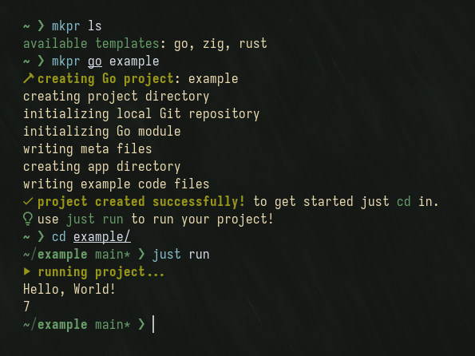

# mkpr — make project
Fast Zig CLI tool to create projects from a set of opinionated language templates



## Usage
`mkpr <template> <project-name>`
- Use `mkpr ls` for a list of templates

## Motive
Originally based on my project [golaunch](https://github.com/Sophed/golaunch), mkpr is intended to be a comprehensive set of utility scripts and templates for my personal projects.

[Just](https://github.com/casey/just) was chosen as the action runner of choice for its flexibility and simple shell-like syntax. Running `just build` and having a cohesive toolchain is far simpler than having build scripts with different syntax for each language I use for a project.

## Installing
- I'll add to some package repos eventually
- Until then, there is binaries available in [releases](https://github.com/Sophed/mkpr/releases)

## Building
- Requires `zig` version **0.13.0** and `just` installed
```
git clone https://github.com/Sophed/mkpr
cd mkpr
just build
```
- Output binaries can be found in `zig-out/bin/`

## Available Templates
### Go
- Requires `go` installed
<details>
  <summary>Click to view project structure</summary>

  ```
    example
    ├─ app
    │  ├─ main.go
    │  └─ main_test.go
    ├─ build
    │  └─ bin <- output binary
    ├─ go.mod
    ├─ justfile <- build/run/test scripts
    ├─ LICENSE <- auto generated MIT license from username/current year
    └─ README.md <- auto generated with project name
  ```
</details>

### Rust
- Requires `cargo` installed
- The built in `cargo init` was mostly sufficient, this template just adds meta files
<details>
  <summary>Click to view project structure</summary>

  ```
    example
    ├── Cargo.lock
    ├── Cargo.toml
    ├── justfile <- build/run/test scripts
    ├── LICENSE <- auto generated MIT license from username/current year
    ├── README.md <- auto generated with project name
    ├── src
    │   └── main.rs
    ├── target
    │   └── ...
    └── tests
        └── example_test.rs
  ```
</details>

### Zig
- Requires `zig` installed (only version 0.13.0 tested, newer versions should still work)
<details>
  <summary>Click to view project structure</summary>

  ```
    example
    ├── build.zig
    ├── build.zig.zon
    ├── justfile <- build/run scripts
    ├── LICENSE <- auto generated MIT license from username/current year
    ├── README.md <- auto generated with project name
    └── src
        └── main.zig
  ```
</details>